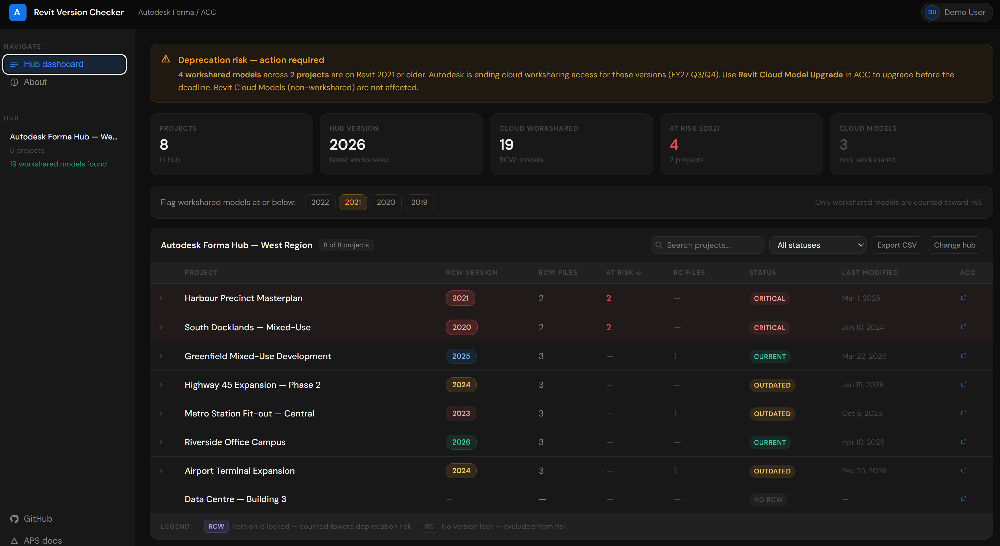

# Revit Version Checker

A free, browser-based tool for scanning Revit file versions across Autodesk Forma / ACC projects — no installs, no backend, no Autodesk subscription required to run it.



---

## Why this exists

Version visibility has been one of the most common requests from ACC customers for years — and the product team still hasn't shipped it natively. Meanwhile, Autodesk just announced that Revit Cloud Models on versions older than the current minus five will be deprecated for cloud worksharing access (starting FY27 Q3/Q4). That means teams with old files on Revit 2021 or earlier are on a clock and most of them don't even know it yet.

This tool gives you a full picture of where your project stands in under a minute.

---

## What it does

Connect it to your ACC hub, pick a project, click a folder — it recursively walks every subfolder and pulls the Revit version for every `.rvt` file it finds. Results show up in a sortable table with the full folder path, last modified date, who touched it, and file size. Export to CSV when you're done.

---

## Version colour key

| Badge | Meaning |
|-------|---------|
| Green | Latest version found in the project |
| Blue | One version behind latest |
| Amber | Two versions behind latest |
| Red | Three or more versions behind — upgrade before deprecation hits |
| Gray | Version could not be read (non-cloud / local upload) |

---

## Getting started

### What you need
- An [APS app](https://aps.autodesk.com) with `data:read` scope
- A 3-legged OAuth Bearer token for your ACC user
- Access to at least one ACC / Forma project

### Get a token
The quickest way is via [Postman](https://postman.com) using the APS token endpoint:

```
POST https://developer.api.autodesk.com/authentication/v2/token
```

With body params: `grant_type=client_credentials`, `client_id`, `client_secret`, `scope=data:read`

### Run it
No install needed. Either:

**Use the hosted version:** [tsb2127.github.io/revit-version-checker](https://tsb2127.github.io/revit-version-checker)

**Or run locally:**
```bash
git clone https://github.com/tsb2127/revit-version-checker.git
cd revit-version-checker
open index.html
```

---

## How it works

Uses the APS Data Management API to walk the folder tree. For each `.rvt` file, it calls:

```
GET /data/v1/projects/{projectId}/items/{itemId}/versions
```

And reads `attributes.extension.data.revitProjectVersion` — the field ACC stores the Revit year in for cloud workshared models.

| Endpoint | Purpose |
|----------|---------|
| `GET /project/v1/hubs` | List ACC hubs |
| `GET /project/v1/hubs/{hubId}/projects` | List projects |
| `GET /project/v1/hubs/{hubId}/projects/{projectId}/topFolders` | Get root folders |
| `GET /data/v1/projects/{projectId}/folders/{folderId}/contents` | Recurse folder tree |
| `GET /data/v1/projects/{projectId}/items/{itemId}/versions` | Read version metadata |

Pure client-side — no server, no data leaves your browser.

---

## Limitations

- `revitProjectVersion` is only populated for **Revit Cloud Models** (workshared files published to ACC). Local `.rvt` files uploaded as plain uploads will show `—`
- Tokens expire after 1 hour — regenerate and re-paste if the app stops loading data
- No built-in OAuth login yet — token must be obtained externally (see roadmap)

---

## Roadmap

- [ ] Built-in OAuth login (PKCE flow — no token copy-pasting)
- [ ] Required version enforcement with pass/fail column per project standard
- [ ] Upgrade urgency flag tied to Autodesk's deprecation timeline
- [ ] Slack / email digest for weekly version health summary

---

## Built by

Tanmay Bhalerao — Senior Account Technical Lead at Autodesk, working with AEC customers across the US. Built this because customers kept asking for it and it didn't exist.

---

## License

MIT — use it, fork it, build on it.
